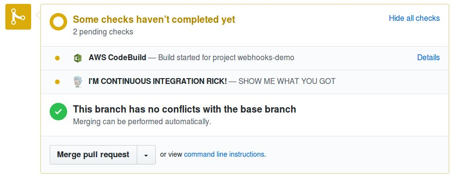
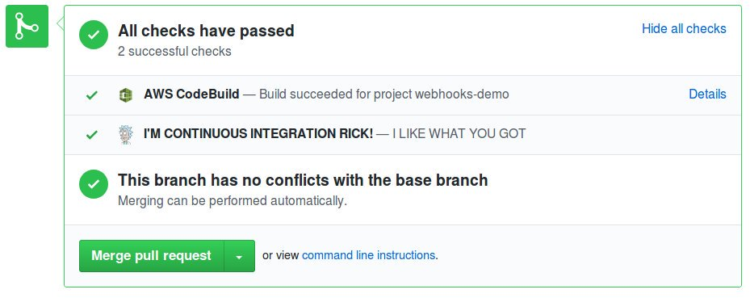

## I'm Continuous Integration Rick!

Demo that reports a custom-formatted Rick-and-Morty-themed build status to a GitHub pull request.  Built on top of AWS Lambda.  This example responds to CodeBuild build events in CloudWatch Events, but you can update it to report the status of any kind of job triggered by a pull request.





### To install in your AWS account and GitHub account

First, set up a CodeBuild project that builds a repository in your GitHub account, with a GitHub webhook to trigger builds for pull requests. [See directions here.](https://docs.aws.amazon.com/codebuild/latest/userguide/sample-github-pull-request.html)

Create a custom OAuth application in your GitHub account:

1. Go to https://github.com/settings/applications/new
1. Use "I'M CONTINUOUS INTEGRATION RICK!" for the application name.
1. Use any random URL for the homepage URL and callback URL.
1. Use any Rick avatar image for the application logo
1. Save the application's client ID and secret in a JSON file named cli-authorization.json with the format:
```
{
  "scopes": [
    "repo"
  ],
  "client_id": "myclientid",
  "client_secret": "myclientsecret"
}
```

Retrieve an OAuth token for the application:

1. Run `curl -X POST -H "X-GitHub-OTP: 123456" --user "$GITHUB_USERNAME:$GITHUB_PASSWORD" --data "@cli-authorization.json" https://api.github.com/authorizations`. Note that the OTP is only necessary if you have MFA enabled for your account.
1. Store the token (in the 'token' field of the response above) in Parameter Store: `aws ssm put-parameter --name ci-rick-github-token --type SecureString --value <OAuth token>`

Then spin up the stack in CloudFormation:
```
npm install

aws cloudformation package --template-file template.yml --s3-bucket <s3 bucket> --force-upload --output-template-file template-packaged.yml

aws cloudformation deploy --stack-name ci-rick --template-file template-packaged.yml --capabilities CAPABILITY_NAMED_IAM
```

### Test Locally

```
sam local invoke -e test_event.json -n test_env_vars.json
```
